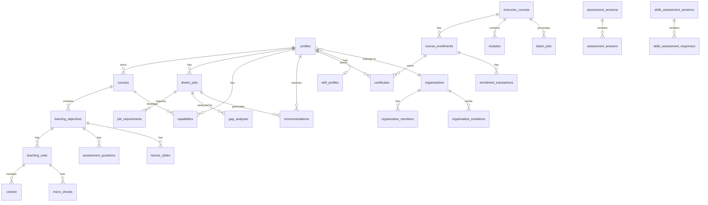

# Database Schema Analysis

**Assessment Date:** January 26, 2026
**PostgreSQL Version:** Supabase PostgreSQL
**Total Tables:** 73
**Database Functions:** 30+
**Migrations:** 88

---

## Executive Summary

| Category | Count |
|----------|-------|
| Core User Tables | 8 |
| Learning Content Tables | 15 |
| Assessment Tables | 10 |
| Career/Jobs Tables | 8 |
| AI/Generation Tables | 12 |
| Payments/Billing Tables | 6 |
| Organization Tables | 6 |
| Tracking/Analytics Tables | 8 |

---

## Entity Relationship Diagram

---

## Core User Tables (8)

### profiles
Primary user table with account information.

| Column | Type | Description |
|--------|------|-------------|
| id | uuid | Primary key |
| user_id | uuid | Supabase Auth user ID |
| full_name | text | User's full name |
| email | text | Email address |
| university | text | University name |
| major | text | Field of study |
| graduation_year | integer | Expected graduation |
| subscription_tier | text | free/pro/enterprise |
| subscription_status | text | active/past_due/canceled |
| is_instructor_verified | boolean | Instructor status |
| is_identity_verified | boolean | IDV status |
| organization_id | uuid | FK to organizations |
| onboarding_completed | boolean | Onboarding status |

### skill_profiles
User's skill and interest profiles.

| Column | Type | Description |
|--------|------|-------------|
| id | uuid | Primary key |
| user_id | uuid | FK to profiles |
| riasec_scores | jsonb | RIASEC interest scores |
| skill_levels | jsonb | Skill proficiency levels |
| career_values | jsonb | Career value rankings |
| assessment_completed_at | timestamp | Assessment date |

### user_roles
Role assignments for access control.

| Column | Type | Description |
|--------|------|-------------|
| id | uuid | Primary key |
| user_id | uuid | FK to profiles |
| role | text | admin/instructor/student |

### user_achievements
Gamification achievements earned.

| Column | Type | Description |
|--------|------|-------------|
| id | uuid | Primary key |
| user_id | uuid | FK to profiles |
| achievement_id | uuid | FK to achievements |
| unlocked_at | timestamp | When earned |

### user_xp
Experience points tracking.

| Column | Type | Description |
|--------|------|-------------|
| id | uuid | Primary key |
| user_id | uuid | FK to profiles |
| total_xp | integer | Total XP earned |
| current_level | integer | Current level |

---

## Learning Content Tables (15)

### courses
User-added courses from transcripts.

| Column | Type | Description |
|--------|------|-------------|
| id | uuid | Primary key |
| user_id | uuid | FK to profiles |
| title | text | Course title |
| code | text | Course code |
| instructor | text | Instructor name |
| syllabus_url | text | Syllabus link |
| analysis_status | text | pending/analyzing/complete |

### learning_objectives
Learning objectives extracted from courses.

| Column | Type | Description |
|--------|------|-------------|
| id | uuid | Primary key |
| course_id | uuid | FK to courses |
| title | text | Objective title |
| bloom_level | text | Bloom's taxonomy level |
| action_verb | text | Learning action verb |
| mastery_score | integer | Mastery percentage |

### teaching_units
Content units for each learning objective.

| Column | Type | Description |
|--------|------|-------------|
| id | uuid | Primary key |
| learning_objective_id | uuid | FK to learning_objectives |
| title | text | Unit title |
| sequence_order | integer | Display order |
| generation_status | text | pending/generating/complete |
| slide_style | text | Layout style |

### lecture_slides
Generated slide content.

| Column | Type | Description |
|--------|------|-------------|
| id | uuid | Primary key |
| teaching_unit_id | uuid | FK to teaching_units |
| slide_number | integer | Slide order |
| slide_type | text | title/content/summary |
| title | text | Slide title |
| content | jsonb | Slide content |
| speaker_notes | text | Narration text |
| image_url | text | Generated image |

### content
External content linked to units.

| Column | Type | Description |
|--------|------|-------------|
| id | uuid | Primary key |
| teaching_unit_id | uuid | FK to teaching_units |
| content_type | text | video/article/course |
| provider | text | youtube/coursera/etc |
| external_url | text | Content URL |
| title | text | Content title |
| duration_minutes | integer | Duration |
| relevance_score | number | Match score |

### micro_checks
Comprehension check questions.

| Column | Type | Description |
|--------|------|-------------|
| id | uuid | Primary key |
| content_id | uuid | FK to content |
| question_text | text | Question |
| timestamp_seconds | integer | When to show |
| correct_answer | text | Answer |

### instructor_courses
Instructor-created courses.

| Column | Type | Description |
|--------|------|-------------|
| id | uuid | Primary key |
| instructor_id | uuid | FK to profiles |
| title | text | Course title |
| description | text | Description |
| price_cents | integer | Course price |
| is_published | boolean | Published status |

### modules
Course modules/sections.

| Column | Type | Description |
|--------|------|-------------|
| id | uuid | Primary key |
| instructor_course_id | uuid | FK to instructor_courses |
| title | text | Module title |
| sequence_order | integer | Display order |

### course_enrollments
Student enrollments in instructor courses.

| Column | Type | Description |
|--------|------|-------------|
| id | uuid | Primary key |
| student_id | uuid | FK to profiles |
| instructor_course_id | uuid | FK to instructor_courses |
| enrolled_at | timestamp | Enrollment date |
| completed_at | timestamp | Completion date |

---

## Assessment Tables (10)

### assessment_questions
Questions for learning objectives.

| Column | Type | Description |
|--------|------|-------------|
| id | uuid | Primary key |
| learning_objective_id | uuid | FK to learning_objectives |
| question_type | text | mcq/short_answer |
| question_text | text | Question text |
| options | jsonb | MCQ options |
| correct_answer | text | Correct answer |
| bloom_level | text | Difficulty level |

### assessment_sessions
Assessment attempt sessions.

| Column | Type | Description |
|--------|------|-------------|
| id | uuid | Primary key |
| user_id | uuid | FK to profiles |
| learning_objective_id | uuid | FK to learning_objectives |
| status | text | in_progress/completed |
| total_score | integer | Final score |
| passed | boolean | Pass status |

### assessment_answers
Individual answers in sessions.

| Column | Type | Description |
|--------|------|-------------|
| id | uuid | Primary key |
| session_id | uuid | FK to assessment_sessions |
| question_id | uuid | FK to assessment_questions |
| user_answer | text | Submitted answer |
| is_correct | boolean | Correctness |
| time_taken_seconds | integer | Response time |

### assessment_item_bank
Shared assessment question bank.

| Column | Type | Description |
|--------|------|-------------|
| id | uuid | Primary key |
| framework | text | RIASEC/skills/values |
| measures_dimension | text | What it measures |
| question_text | text | Question |
| question_type | text | likert/mcq |
| response_options | jsonb | Options |

### skills_assessment_sessions
Skills assessment sessions.

| Column | Type | Description |
|--------|------|-------------|
| id | uuid | Primary key |
| user_id | uuid | FK to profiles |
| assessment_type | text | quick/full |
| status | text | in_progress/completed |
| completed_at | timestamp | Completion time |

### skills_assessment_responses
Responses to skills assessments.

| Column | Type | Description |
|--------|------|-------------|
| id | uuid | Primary key |
| session_id | uuid | FK to skills_assessment_sessions |
| item_id | uuid | FK to assessment_item_bank |
| response_value | integer | Score (1-5) |

---

## Career/Jobs Tables (8)

### dream_jobs
User's career aspirations.

| Column | Type | Description |
|--------|------|-------------|
| id | uuid | Primary key |
| user_id | uuid | FK to profiles |
| job_title | text | Job title |
| company_name | text | Target company |
| is_primary | boolean | Primary goal |
| match_score | integer | Fit score |

### job_requirements
Requirements for dream jobs.

| Column | Type | Description |
|--------|------|-------------|
| id | uuid | Primary key |
| dream_job_id | uuid | FK to dream_jobs |
| skill_name | text | Required skill |
| importance | text | must_have/nice_to_have |
| proficiency_required | text | Level needed |

### gap_analyses
Gap analysis results.

| Column | Type | Description |
|--------|------|-------------|
| id | uuid | Primary key |
| dream_job_id | uuid | FK to dream_jobs |
| user_id | uuid | FK to profiles |
| skill_overlaps | jsonb | Matching skills |
| skill_gaps | jsonb | Missing skills |
| gap_score | integer | Overall gap |

### recommendations
Learning recommendations.

| Column | Type | Description |
|--------|------|-------------|
| id | uuid | Primary key |
| dream_job_id | uuid | FK to dream_jobs |
| user_id | uuid | FK to profiles |
| recommendation_type | text | course/project/skill |
| title | text | Recommendation title |
| description | text | Details |
| priority_score | integer | Priority rank |
| is_ai_generated | boolean | AI vs manual |

### career_matches
Matched careers from skills.

| Column | Type | Description |
|--------|------|-------------|
| id | uuid | Primary key |
| user_id | uuid | FK to profiles |
| onet_soc_code | text | O*NET code |
| occupation_title | text | Job title |
| match_score | integer | Fit score |
| riasec_match | jsonb | Interest alignment |

### onet_occupations
Cached O*NET occupation data.

| Column | Type | Description |
|--------|------|-------------|
| id | uuid | Primary key |
| soc_code | text | SOC code |
| title | text | Occupation title |
| description | text | Description |
| skills | jsonb | Required skills |
| median_wage | integer | Salary data |

---

## Certificates Tables

### certificates
Issued certificates.

| Column | Type | Description |
|--------|------|-------------|
| id | uuid | Primary key |
| enrollment_id | uuid | FK to course_enrollments |
| certificate_type | text | completion_badge/verified/assessed |
| certificate_number | text | Unique number |
| share_token | text | Public share token |
| issued_at | timestamp | Issue date |
| pdf_url | text | PDF location |

### identity_verifications
IDV records.

| Column | Type | Description |
|--------|------|-------------|
| id | uuid | Primary key |
| user_id | uuid | FK to profiles |
| provider | text | persona/onfido |
| status | text | pending/verified/failed |
| verified_full_name | text | Verified name |
| completed_at | timestamp | Completion date |

---

## AI/Generation Tables (12)

### batch_jobs
Vertex AI batch job tracking.

| Column | Type | Description |
|--------|------|-------------|
| id | uuid | Primary key |
| google_batch_id | text | Vertex batch ID |
| instructor_course_id | uuid | FK to instructor_courses |
| job_type | text | slides/curriculum/research |
| status | text | pending/running/complete |
| total_requests | integer | Items in batch |
| succeeded_count | integer | Successful items |

### image_generation_queue
Async image generation queue.

| Column | Type | Description |
|--------|------|-------------|
| id | uuid | Primary key |
| lecture_slides_id | uuid | FK to lecture_slides |
| status | text | pending/processing/complete |
| attempts | integer | Retry count |
| error_message | text | Last error |

### ai_usage
AI API usage tracking.

| Column | Type | Description |
|--------|------|-------------|
| id | uuid | Primary key |
| user_id | uuid | FK to profiles |
| function_name | text | Which function |
| model_used | text | AI model |
| input_tokens | integer | Tokens in |
| output_tokens | integer | Tokens out |
| cost_usd | decimal | Cost |

### ai_cache
AI response caching.

| Column | Type | Description |
|--------|------|-------------|
| id | uuid | Primary key |
| cache_key | text | Hash key |
| cache_type | text | Type of cache |
| response_data | jsonb | Cached response |
| expires_at | timestamp | Expiration |

### content_search_cache
Cached content search results.

| Column | Type | Description |
|--------|------|-------------|
| id | uuid | Primary key |
| query_hash | text | Query signature |
| provider | text | Search provider |
| results | jsonb | Search results |
| created_at | timestamp | Cache time |

---

## Organization Tables (6)

### organizations
Organization/institution accounts.

| Column | Type | Description |
|--------|------|-------------|
| id | uuid | Primary key |
| name | text | Org name |
| domain | text | Email domain |
| settings | jsonb | Configuration |
| branding | jsonb | Custom branding |

### organization_members
Org membership.

| Column | Type | Description |
|--------|------|-------------|
| id | uuid | Primary key |
| organization_id | uuid | FK to organizations |
| user_id | uuid | FK to profiles |
| role | text | admin/member |

### employer_accounts
Employer verification accounts.

| Column | Type | Description |
|--------|------|-------------|
| id | uuid | Primary key |
| user_id | uuid | FK to profiles |
| company_name | text | Company |
| verified | boolean | Verified status |

### employer_api_keys
Employer API access.

| Column | Type | Description |
|--------|------|-------------|
| id | uuid | Primary key |
| employer_account_id | uuid | FK to employer_accounts |
| key_hash | text | Hashed API key |
| name | text | Key name |
| is_active | boolean | Active status |

---

## Database Functions (30+)

### Authentication & Authorization
- `get_user_role(user_id)` - Get user's role
- `has_role(user_id, role)` - Check role
- `accept_organization_invitation(token)` - Join org

### Certificate Generation
- `generate_certificate_number()` - Create unique cert number
- `generate_share_token()` - Create share token
- `generate_employer_api_key(employer_id)` - Create API key

### Skills & Matching
- `find_similar_capabilities(skill_name)` - Find skill synonyms
- `get_user_skill_profile(user_id)` - Get skill profile
- `get_dynamic_synonyms(term)` - Get learned synonyms

### Gamification
- `award_xp(user_id, amount, reason)` - Add XP
- `calculate_level(xp)` - Calculate level from XP
- `check_achievements(user_id)` - Check unlockable achievements
- `grant_achievement(user_id, key)` - Grant achievement

### Usage & Limits
- `increment_ai_usage(user_id, tokens)` - Track AI usage
- `increment_api_usage(api_name)` - Track API quota
- `get_remaining_quota(user_id, limit_type)` - Check quota
- `check_tier_limit(user_id, action)` - Check tier limits

### Caching
- `cleanup_expired_cache()` - Clear old cache
- `find_similar_cached_search(query)` - Find similar searches

---

## RLS Policies Summary

All user-facing tables have RLS enabled with policies:
- **User tables:** Users can only access their own data
- **Organization tables:** Members can access org data
- **Reference tables:** Read-only for authenticated users
- **Service tables:** Service role only

---

## Schema Health Assessment

### Strengths
- Comprehensive RLS policies
- Proper foreign key relationships
- UUID primary keys throughout
- Timestamp tracking (created_at, updated_at)

### Concerns
- **88 migrations:** Consider consolidation
- **Some duplicate tables:** api_quota_tracking vs api_usage_tracking
- **Large jsonb columns:** Could cause performance issues
- **Missing indexes:** Need performance audit

### Recommendations
1. Audit and consolidate migrations
2. Add indexes on frequently queried columns
3. Review jsonb column sizes
4. Consider partitioning for large tables
